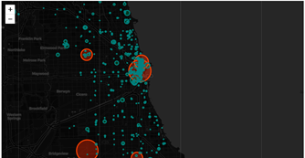
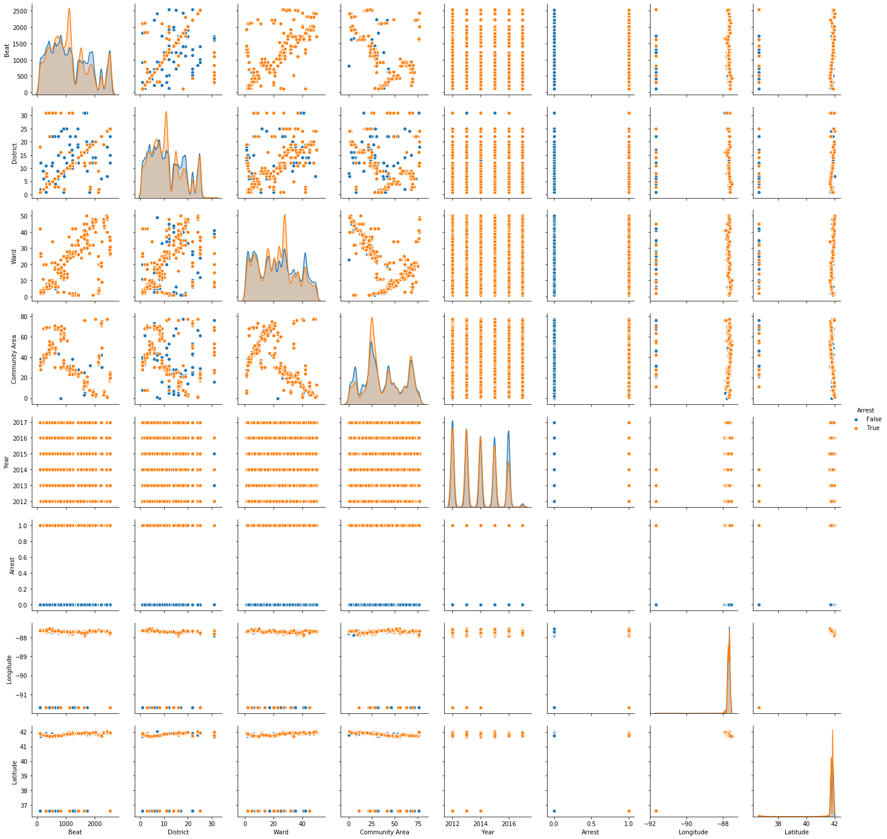
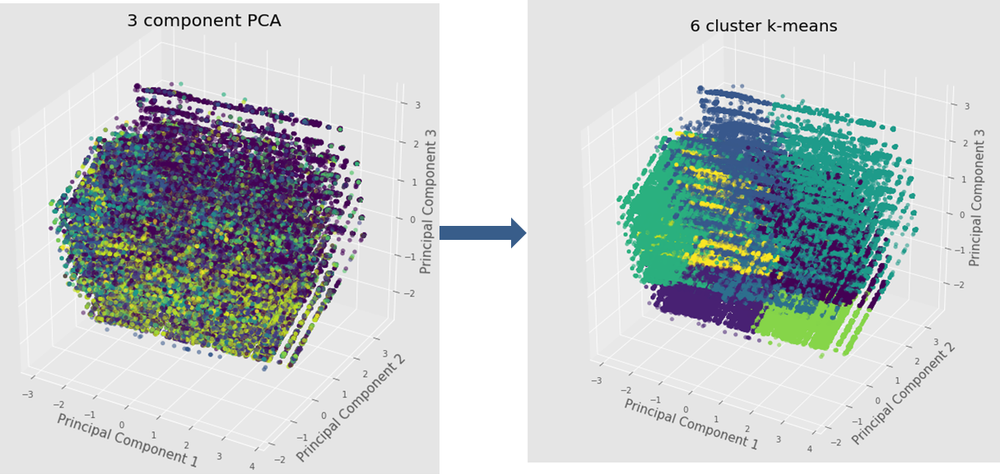
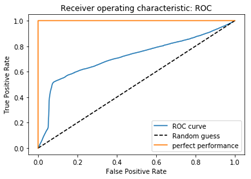

For a detailed report please refer to: https://github.com/ddhruvgupta/DataMining/blob/master/Chicago%20Crimes%20Analysis/DataMining_FinalProject.pdf

**Introduction**

This study uses the Chicago Crimes dataset to conduct an exploratory data analysis on the factors affecting crime rate and find correlations in the elements that can be used for crime prediction. To do this, several machine learning algorithms have been used to answer research questions like 
- Rate of change in crime rate over time
- Types of crimes which have the highest occurrence 

Specifically, carrying out performance comparison of a multi class – classifiers. The Naïve Bayes classifier gave 75 per cent accuracy, while on the other hand the classifier built using Random Forest gave our model an accuracy which was greater than 95 per cent.

**Steps**

  •	 Conduct data cleaning  
  •	 Visualize initial trends in crime data  
  •	 Conduct exploratory data analysis (EDA) to find the most important variables for predicting type crime  
  •	 Confirm that such a prediction is possible to make using machine learning techniques  
  •	 Compare different approaches for classification and identify the most efficient method  

**Dataset**  
https://www.kaggle.com/currie32/crimes-in-chicago/downloads/Chicago_Crimes_2012_to_2017.csv/1.h

**Results**

Classifier | Accuracy
--- | ---
Naïve Bayes (Arrests) |	84 %
Radom Forrest (Arrests)|	86 %
Random Forest (1 tree) |	93 %
Random Forest (2 tree)|	91 %
Random Forest (15 trees)|	97%
Random Forest (15 trees) without FBI|	38 %
Random Forest w/o FBI w/ (with cluster targets)|	73 % (15 trees)

**Conclusion**

Naïve Bayes is a good classifier for predicting if someone is like to get arrested based on location and the type of crime being committed. Random Forest is performed for the same target variable and is found to be marginally better. 
Random Forest has good accuracy to predict the type of crime based on the input vector consisting of all features in the dataset except Primary Type. However, the prediction was found to be very dependent on the FBI code and a study of the model minus the FBI code produced a model of only 38% accuracy. In case where Primary Types were clustered together, the Random Forest algorithm was able to predict the correct cluster at 73% accuracy. From the results the authors provide an acceptable baseline model for predicting the type of crime. 

**Visualzing Results**
 

 

 

 

